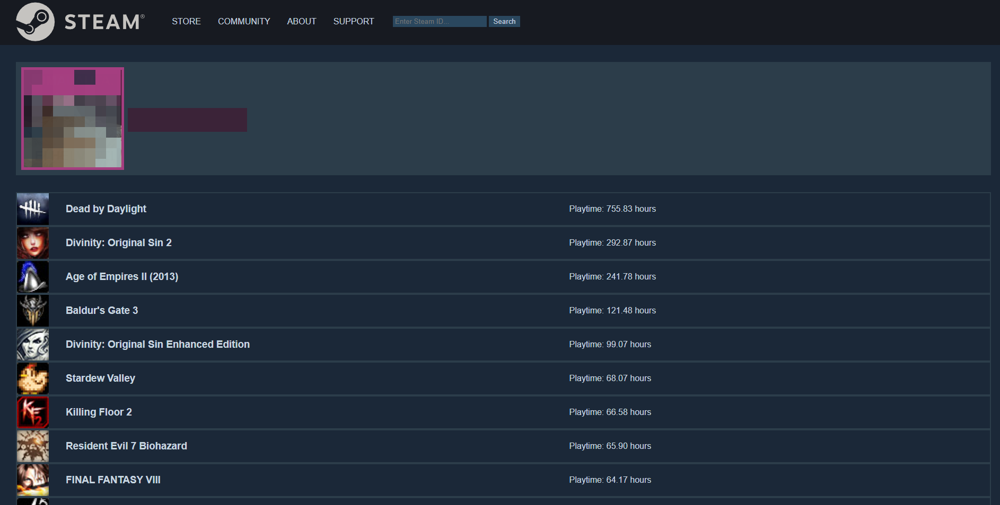

Application that uses the Steam API. The user can enter a Steam vanity ID, if the vanity ID is valid the app will display the username and avatar, and list all games and playtime for that account.

In order for the app to work you have to make a data.json file with your Steam API key and default steam ID - similar to the dataExample.json that I have included in the repo.

